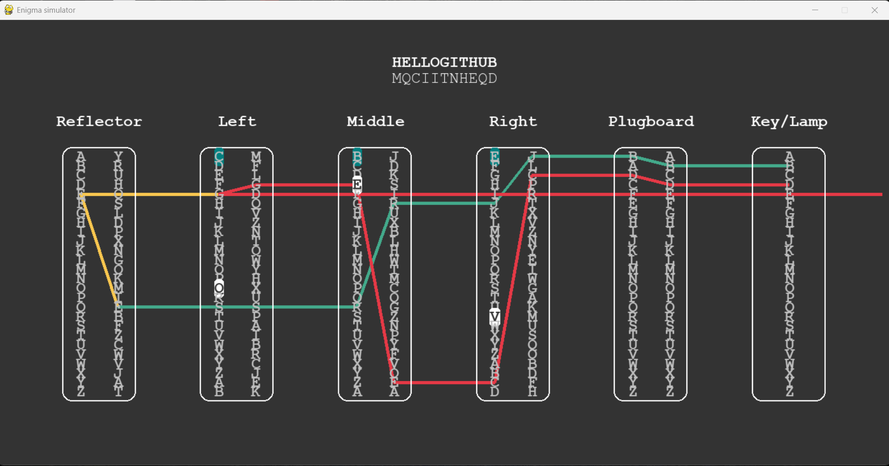

# 🔐 Enigma Machine Emulator
This is my attempt at creating the [Enigma Machine](https://en.wikipedia.org/wiki/Enigma_machine) used by the Germans in WW2 to encrypt messages.

Rotor configurations can be found [here](https://www.codesandciphers.org.uk/enigma/rotorspec.htm).

A nice simulator can be found [here](https://mckoss.com/enigma-simulator-js/).


## 🚀 Features
 -Simulates rotors, reflector, plugboard, and keyboard
 
 -Custom rotor selection and ring settings
 
 -Real-time encryption and decryption of messages
 
 -Historically accurate rotor stepping mechanism
 
 -CLI-based interface for easy interaction

 ## 📽️ Visualization
 


## 🛠️ Tech Stack
- Python 3
- Object-Oriented Programming
- `pygame`

## 📁 Project Structure
Enigma/
├── Enigma.py # Core logic of the machine
├── Rotor.py # Rotor class with wiring and stepping
├── Reflector.py # Reflector logic
├── Plugboard.py # Plugboard swap settings
├── project.py # Entry point for user interaction
├── README.md # Project documentation
├── Enigma.png # Screenshot image
├── draw.py #GUI
└──keyboard.py #keyboard logic


## 🔧 How to Run

1. **Clone the repository:**
```bash
git clone https://github.com/Yashdagoat1/Enigma.git
cd Enigma

2. **Run the emulator:**
 project.py

#Example usecase
Enter message: HELLOWORLD
Rotor Order: I II III
Ring Settings: A A A
Plugboard Settings AB CD EF
ROTOR START:CAT
Encrypted:MQCIIZDLYP

